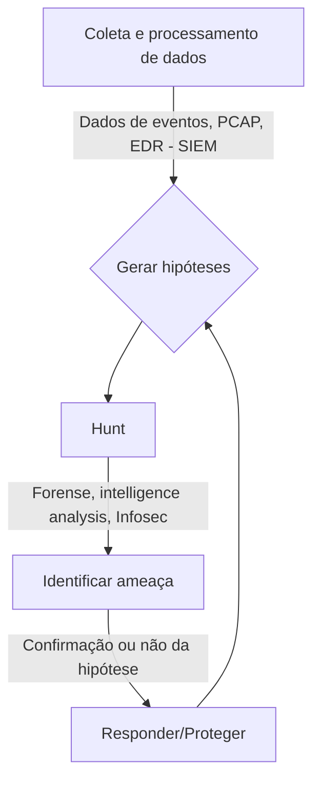

# Cyber Threat Intelligence
Compartilhamento de informação sobre ameaças e recursos de pesquisa.

- [Cyber Threat Intelligence](#cyber-threat-intelligence)
  * [Threat Intel](#threat-intel)
  * [Nation-State Hackers](#Nation-State-Hackers)
  * [APT Groups](#apt-groups)
  * [Threat hunting](#threat-hunting)
  * [Threat hunting - hipótese](#threat-hunting---hip%C3%B3tese)
  * [Indicators of Compromise (IOCs)](#indicators-of-compromise-iocs)
  * [Indicators of Attack (IOAs)](#indicators-of-attack--ioas)
  * [Manipulação de Malware](#Manipulação-de-Malware) 
  * [LOLBins](#lolbins)
  * [TTPs](#ttps)
  * [LINKS](#links)
  * [Twitter Accounts](https://github.com/danieldonda/Cyber-Threat-Intelligence/tree/main/twitter.md)

- [:fire: Conflito Ucrania e Russia 2022](https://github.com/danieldonda/Cyber-Threat-Intelligence/tree/main/ukraine-russia)

## Threat Intel
Em resumo Threat Intel é a coleta e analise de informações que permite entender possiveis ameaças antecipadamente e acelerar detecção ou resposta. Isso permite entender se existe a sua empresa é um possivel alvo de atores maliciosos seja por motivo `Geopolitico`, `Cyber-espionagem`, `competição industrial`, `sabotagem`, `hacktivismo`, entre outros.
Essa analise permite entender se determinados comportamentos de ataque poderão ser direcionados a sua empresa e então tomar ações proativas. Isso é possivel pois no processo de coleta e análise de `CTI(Cyber Threat Intelligence)` vamos encontrar diversos artefatos que correlacionados indicam comportamentos ou relações com grupos especializados.

## Nation-State Hackers
Nation-State Hackers ou Nation-State Threat Actor  é um termo usado para descrever grupos ou indivíduos que operam em nome de um governo específico, com o objetivo de realizar ataques cibernéticos para obter informações confidenciais, causar danos ou interromper operações. Eles podem se envolver em atividades como espionagem, roubo de propriedade intelectual, sabotagem e difamação. Esses atores podem ser agentes do governo, agências de inteligência ou outras organizações governamentais, ou podem ser indivíduos contratados ou patrocinados pelo governo.

Alguns exemplos de Nation-State Threat Actor incluem:

- APT (Advanced Persistent Threat) grupos, como APT10, APT28, APT29, etc.
- Equipes de operações cibernéticas de países como Rússia, China, Coreia do Norte, Irã e EUA.

É importante notar que a identificação de um Nation-State Threat Actor pode ser difícil, pois esses grupos geralmente operam de forma discreta e podem usar técnicas de ocultação para esconder sua origem. Além disso, as fronteiras entre atividades cibernéticas de espionagem, cybercrime e guerra cibernética podem ser nebulosas, e a intenção ou o objetivo de um ataque pode ser difícil de determinar.

## APT Groups
Os grupos especializados que executam ataques cibernéticos sofisticados chamados de `APT(Advanced Persistent Threat)` . O termo APT também se refere a grupos de atores maliciosos, geralmente `nation state` ou `state-sponsored group`. Os grupos APT possuem gteralmente motivações políticas ou econômicas.
Lista de grupos APT 
https://attack.mitre.org/groups/ 

## Threat hunting

## Threat hunting - hipótese
O processo de `Threat hunting` pode ser dividido em três etapas:

1. Criar uma hipótese realística
2. Executá-la
3. Testá-la até a conclusão.

É melhor combinar indicadores de comprometimento, fatores ambientais. geopoliticos e experiência no setor para criar as buscas de ameaças mais eficazes e de alta eficácia.

------------
## Indicators of Compromise (IOCs)

Um **IOC** é um dado forense que tem o potencial de identificar atividades maliciosas em um sistema. Em outras palavras, um IOC é uma forte indicação que alerta os **Threat Hunters** sobre uma ameaça potencial. **Reativo**

## Indicators of Attack (IOAs)

Um **IOA** é um dado forense que tem o potencial de identificar atividades maliciosas em um sistema em andamento. Execução de códigos, Persistencia, Command Control, Movimentação Lateral. **Proativo**

- Padrões de tráfego incomuns entre sistemas internos
- Padrões de uso incomuns para contas privilegiadas
- Acesso administrativo à sua rede a partir de localizações geográficas insuspeitas
- Um pico nos volumes de leitura do banco de dados
- Alta taxa de tentativas e falhas de autenticação
- Alterações de configuração incomuns

Relacionados a isso temos DLLs, Scripts, Executaveis (PE), dominios, IPs entre outros, e a melhor pratica para "rastrear" esses artefatos é gerando um HASH (FileHash-SHA256) 
Por exemplo:
WinZip_24.exe c0f10b2cdd69a59ff90bfd2c5f9874585d859f9eb994cfa7bc54b9ec30c39508 

Podemos usar um site como o https://www.browserling.com/tools/all-hashes para gerar hashes ou diretamente nas plataformas de hunting/inteligencia que podem gerar automaticamente. 
Por exemplo o https://www.virustotal.com/ ou https://otx.alienvault.com/ irá gerar automaticamente um hash dos arquivos que você subir na plataforma.

## Manipulação de Malware 

Essa dica é mais importante para os analistas de malware do que aqueles que trabalham com threat intel ou threat hunting.  Porém pode ser provavel que em determinadas situações iremos escrever um documento ou manipular arquivos infectados.

- **Arquivos** - Em geral são armazenados em um arquivo ZIP criptografado com a senha **infected**
- **URLs** - Para enviar uma URL ou para escrever um artigo ou relatório usa-se hxxp://exemplo[.]com/malware.php 
- **Endereço IP** - Similar a URLs para manter um endereço IP seguro usamos 192.168.0[.]100

------------
## LOLBins

LOLBins é o termo abreviado para Living Off the Land Binaries. 

LOLBins eram  usados em uma base pós-exploração, para ganhar persistência ou aumentar privilégios. Agora estão sendo usadas para contornar a detecção e ajudar na entrega de malware. O que significa que atores mal-intencionados podem usar esses LOLBins para atingir seus objetivos, sem depender de códigos ou arquivos específicos.
https://lolbas-project.github.io/ 

------------
## TTPs

Com a ajuda do MITRE ATTACK você pode descobrir possíveis intrusões e identificar TTP (Táticas, Técnicas e Procedimentos) associados a ameaças que possam estar presentes na rede do cliente. 

O Mitre D3fend permite analisar através de um gráfico de conhecimento de contramedidas a relação de artefatos e os ataques relacionados. Isso ajuda o profissional de threat hunting a fazer mapeamentos de contramedidas que podem ajudar a enganar, detectar, proteger,despejar e isolar com base em determinado artefato. 

🌐 https://d3fend.mitre.org/

------------
## LINKS
- VirusTotal https://www.virustotal.com/gui/ 
- AlienVault OTX - https://otx.alienvault.com/
- DORKS https://www.exploit-db.com/google-hacking-database 
- Mitre ATT Navigator https://mitre-attack.github.io/attack-navigator/ 
- MITRE D3FEND https://d3fend.mitre.org/
- Using ATT&CK for CTI Training - https://attack.mitre.org/resources/training/cti/
- YARA - http://virustotal.github.io/yara/ 
- ThreatMiner - https://www.threatminer.org/
- RiskIQ Community - https://community.riskiq.com/home
- PasteBin - https://pastebin.com/
- Shodan - https://www.shodan.io/
- Censys - https://censys.io/
- DNSdumpster - https://dnsdumpster.com/
- URLHaus - https://urlhaus.abuse.ch/
- C2 Tracker - http://tracker.viriback.com/stats.php
- MISP - https://www.misp-project.org/
- The Hive - https://thehive-project.org/
- Yeti - https://yeti-platform.github.io/
- PasteScraper - https://github.com/PimmyTrousers/pastescraper

## Atenção
Esse material é para fins de `estudo e pesquisa`.
Essas informações são  destinadas a ajudar estudantes e equipes de segurança cibernética e as postagens aqui não representam nenhum lado politico.
